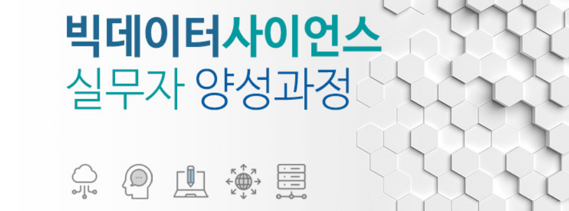

# BigData Science Practical Training Course

Python For BigData @ <a href='https://www.facebook.com/jskim.kr'>FB / jskim.kr</a>, [김진수](bigpycraft@gmail.com)

## SBA 2019, Seoul Business Agency Innovation Growth Intensive Training

## Innovation Growth Intensive Training
- Python Programming Basics
- Python Packages and Modules
- Data Processing and Analysis
- Web Cralwling
- Natural Language Processing
- <b>Machine Learning</b>
- <b>Deep Learning</b>

## Special Lecture 

- CS_1. [Case Study - By Jung Hae-Min                 ][CS_100]
- CS_2. [Case Study - By Min Ah-Young                 ][CS_200]
  
- SP_1. [Special Lecture - Convolution Neural Network ][SP_100]
- SP_2. [Special Lecture - Recurrent Neural Network   ][SP_200]
- SP_3. [Special Lecture - ML for BigData             ][SP_300]
  

[CS_100]:  ./docu/CaseStudy_Ex1.pdf                  "Go CS_100"
[CS_200]:  ./docu/CaseStudy_Ex2.pdf                  "Go CS_200"

[SP_100]:  ./docu/FINAL_SP_Deep_Learning_CNN.pdf     "Go SP_100"
[SP_200]:  ./docu/FINAL_SP_Deep_Learning_RNN.pdf     "Go SP_200"
[SP_300]:  ./docu/FINAL_SP_Machine_Learning.pdf      "Go SP_300"

<marquee>The BigpyCraft find the information to design valuable society with Technology & Craft.</marquee>

 &lt; The End &gt; 

